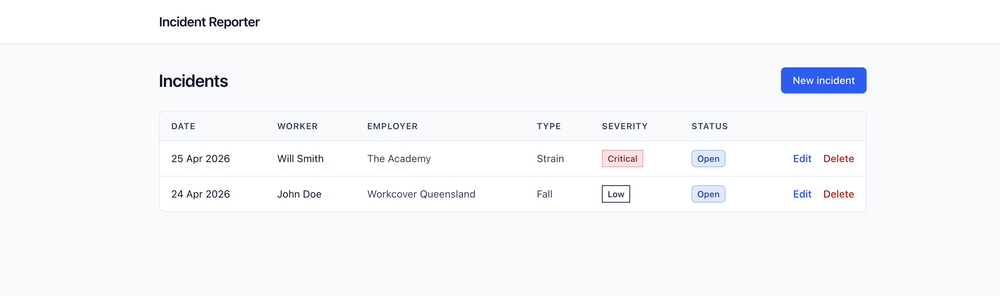
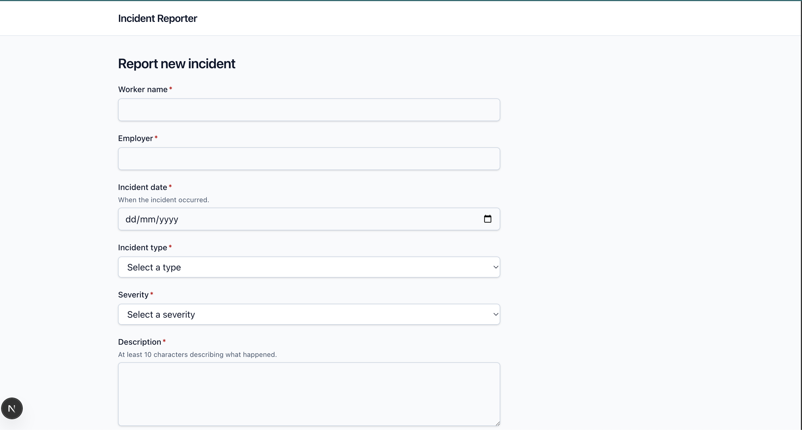
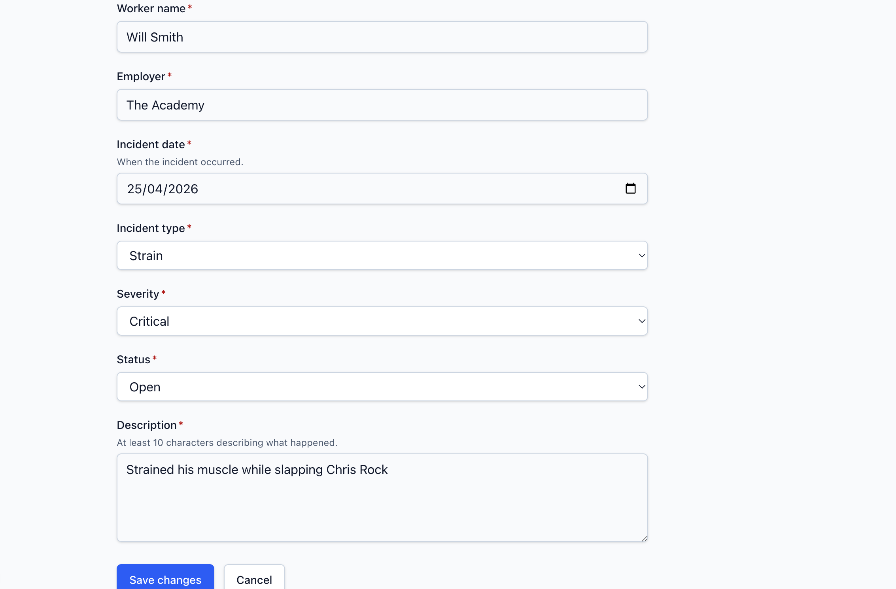
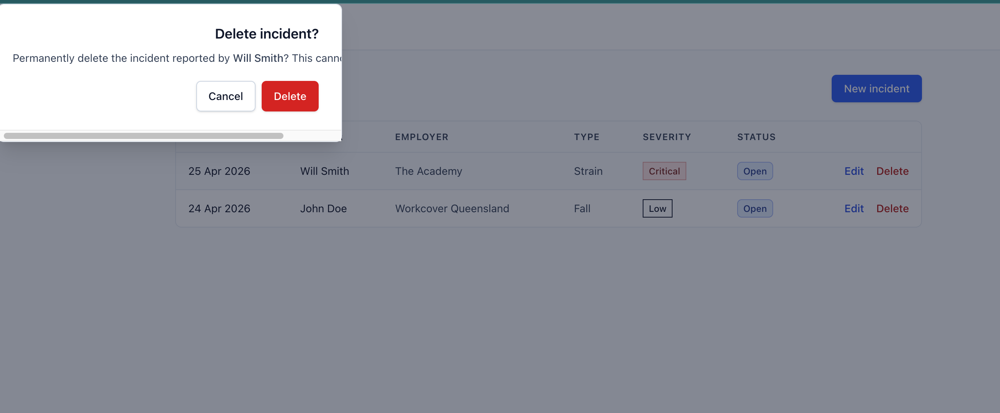

# Workplace Incident Reporter

A full stack CRUD application demonstrating web development with **.NET 10**, **Next.Js 15**, **TypeScript**. 

Workflow:


## Screenshots
Incident list - home


New Incident form


Edit Incident


Delete Incident



## Tech stack

| Layer | Technology | Version |
| --- | --- | --- |
| Backend runtime | .NET / ASP.NET Core | 10.0 (LTS) |
| ORM | Entity Framework Core | 10 |
| Database | SQLite (file-based) | — |
| Frontend framework | Next.js (App Router) | 15 |
| Language | TypeScript | 5.x |
| Styling | Tailwind CSS | v4 |
| Forms & validation | React Hook Form + Zod | latest |
| CI | GitHub Actions | — |
| Branching | Git Flow (`main` / `develop` / `feature/*`) | — |

## Run locally

### Prerequisites
- [.NET 10 SDK](https://dotnet.microsoft.com/download)
- [Node.js 22+](https://nodejs.org/) (the project was developed against 25.x)
- `dotnet-ef` global tool: `dotnet tool install --global dotnet-ef`

### 1. Clone

```bash
git clone https://github.com/Sudinach/Incident-reporter.git
cd Incident-reporter
```

### 2. Backend

```bash
cd backend
dotnet restore
dotnet ef database update     # creates incidents.db and applies migrations
dotnet run
```

The API starts on `http://localhost:5019`.

### 3. Frontend

In a second terminal:

```bash
cd frontend
npm install
echo "NEXT_PUBLIC_API_URL=http://localhost:5019" > .env.local
npm run dev
```

Visit <http://localhost:3000> — you'll be redirected to `/incidents`.


# API reference

| Method | Path | Description |
| --- | --- | --- |
| `GET` | `/api/incidents` | List all incidents, newest first |
| `GET` | `/api/incidents/{id}` | Get one incident by id |
| `POST` | `/api/incidents` | Create a new incident |
| `PUT` | `/api/incidents/{id}` | Update an existing incident |
| `DELETE` | `/api/incidents/{id}` | Delete an incident |
| `GET` | `/health` | Liveness probe — returns `{ status: "ok" }` |


## Project structure

```
Incident-reporter/
├── backend/
│   ├── Controllers/IncidentsController.cs
│   ├── Data/AppDbContext.cs
│   ├── Models/
│   │   ├── Incident.cs
│   │   └── IncidentDtos.cs
│   ├── Migrations/
│   ├── Program.cs
│   └── appsettings.json
├── frontend/
│   ├── app/
│   │   ├── layout.tsx
│   │   ├── globals.css
│   │   └── incidents/
│   │       ├── page.tsx              
│   │       ├── new/page.tsx        
│   │       ├── [id]/edit/page.tsx
│   │       ├── error.tsx
│   │       ├── loading.tsx
│   │       └── [id]/not-found.tsx
│   ├── components/
│   │   ├── atoms/
│   │   ├── molecules/
│   │   └── organisms/
│   └── lib/
│       ├── api.ts
│       ├── schemas.ts
│       └── types.ts
└── .github/workflows/ci.yml
```
---

## Continuous integration

`.github/workflows/ci.yml` runs two parallel jobs on every push and pull request to `main` or `develop`:

- **backend** — `dotnet restore` → `dotnet build --no-restore` → `dotnet test --no-build`
- **frontend** — `npm ci` → `npm run lint` → `npx tsc --noEmit` → `npm run build`

Both jobs must pass before changes can be merged.

---


## Author

Built by Sudin Acharya as a portfolio piece for the Senior Software Engineer (Full Stack) role at WorkCover Queensland.
